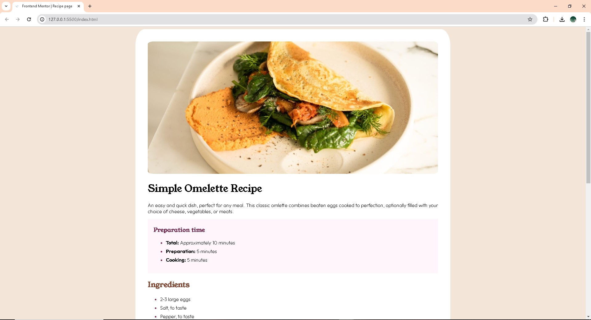
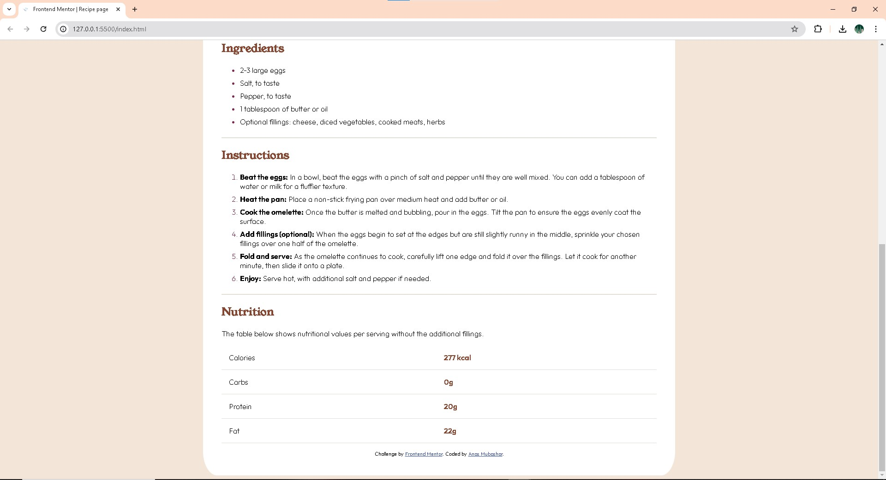

# Frontend Mentor - Recipe page

This is a solution to the Recipe page challenge on Frontend Mentor. Frontend Mentor challenges help you improve your coding skills by building realistic projects.

## Table of contents

- [Overview](#overview)
  - [Screenshot](#screenshot)
  - [Links](#links)
- [My process](#my-process)
  - [Built with](#built-with)
  - [What I learned](#what-i-learned)
  - [Continued development](#continued-development)

## Overview

### Screenshot

### Links

- Live Site URL: https://recipe-page358.netlify.app

## My process

### Built with

Semantic HTML5 markup,
CSS custom properties,
Flexbox,
Mobile-first workflow,

### What I learned

Through this project, I reinforced my knowledge of semantic HTML5 markup and CSS custom properties. I also practiced using Flexbox for layout and ensured the design was mobile-responsive using a mobile-first workflow.

### Continued development

For future projects, I aim to delve deeper into CSS Grid and enhance my skills in responsive design. Additionally, I plan to explore JavaScript to add interactive elements to my web pages.
